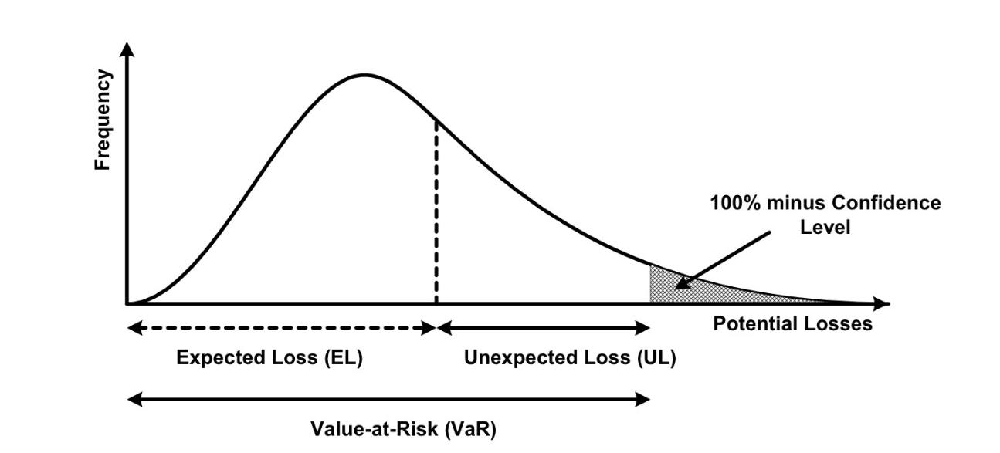

## Credit Risk Modeling - Python

This is a credit risk model made in Python, you can download de datasets used to generate the analysis [here](https://drive.google.com/drive/folders/1IM7wfiwvzlngdyyr-L7Dafdk7oXZZBgN?usp=sharing).

Required Packages
- python 3
- numpy
- scipy
- sklearn
- pandas
- matplotlib
- seaborn

## About the model

Credit risk models need to answer the question: How much is my risk appetite? And for this models was no difference.

The calculation consist in the formula:
EL = PD x LGD x EAD

Where:
EL ⇒ expected losses, causes by borrower specific factor and economic environment \n
PD ⇒ Probability of default \n
- The borrowers inability to pay their loan in full or on time
LGD ⇒ Loss given default
- The proportion of the total exposure that cannot be recovered by the lender once a default has occurred
EAD ⇒ Exposure at default
- The total value that a lender is exposed to when a borrower defaults

This model is based on Basel II framework and under it's guidelines is consider EL, UL, and SL that are terms used describe expected loss, unexpected loss, and specialized lending, respectively. These terms are used in the Internal Ratings-Based (IRB) approach to calculate risk-weighted assets (RWAs) and capital requirements.

