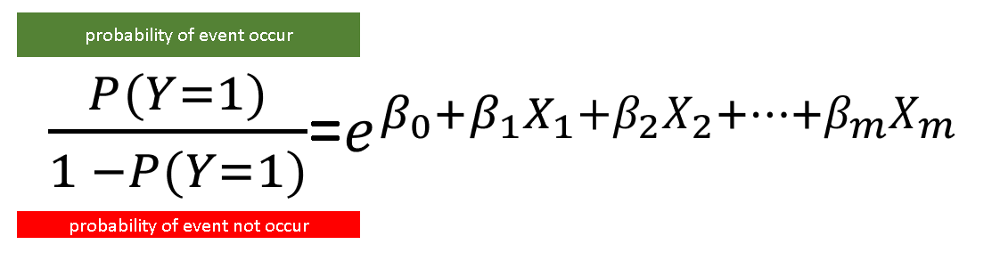

## Credit Risk Modeling - Python

This is a credit risk model developed in Python. You can download the datasets used to generate the analysis [here](https://drive.google.com/drive/folders/1IM7wfiwvzlngdyyr-L7Dafdk7oXZZBgN?usp=sharing).

Required Packages
- python 3
- numpy
- scipy
- sklearn
- pandas
- matplotlib
- seaborn

## About the model

Credit risk models need to answer the question: How much is my risk appetite? This model is no different.

The calculation consists of the following formula: $$\text{EL} = \text{PD} \times \text{LGD} \times \text{EAD}$$

Where:  
EL: Expected losses, caused by borrower-specific factors and the economic environment.  
PD: Probability of default - The borrower’s inability to pay their loan in full or on time.  
LGD: Loss given default - The proportion of the total exposure that cannot be recovered by the lender once a default has occurred 
EAD: Exposure at default - The total value that a lender is exposed to when a borrower defaults

This model is based on the Basel II framework. Under its guidelines, it considers EL (Expected Loss), UL (Unexpected Loss), and SL (Specialized Lending). These terms are used in the Internal Ratings-Based (IRB) approach to calculate risk-weighted assets (RWAs) and capital requirements.

## Statistic model used:  
For this model I choose to use logistic regression, since is widely available documentation on how to implement it in python and is the most used model in industry to calculate default.  

Under the logistic regression, the probability of an event can be represented as the exponential of a linear combination of independent variables and coefficients divided by 1 plus the same exponential

The equation looks like this:

The probability of event occurring divided by the probability of event not occurring is equal to the exponential of odds.

Is this material you will find:
- Models calculation
- Variables selection
- Data cleansing
- Chart analysis
- Variable treatment
- Scorecard

